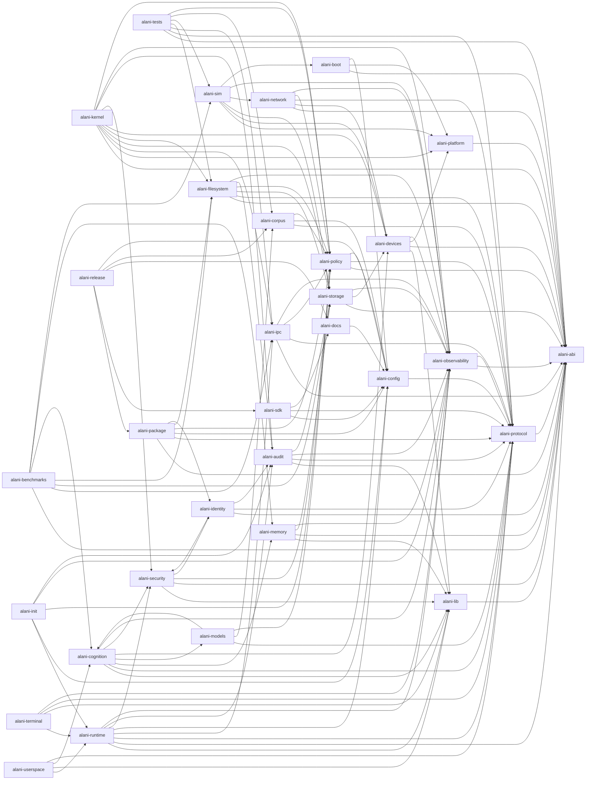

# Document 42: Inter-Repo Interfaces

## Document Control

| Field | Value |
|---|---|
| Project | Alani |
| Document ID | ALANI-SPEC-42 |
| Status | Draft implementation specification |
| Version | 0.2.0-draft |
| Generated | 2026-04-30T23:21:07Z |
| Audience | Developers, integrators |
| Depends on | Docs 06-40, Doc 43, Doc 45, Doc 50, Doc 63 |

## Purpose

This document defines cross-repository dependency, versioning, and integration contracts for the expanded Alani repository set.

## Interface Rules

- Public APIs MUST be versioned and documented before another repository consumes them.
- Cross-repository contracts MUST use Rust crate APIs, C-compatible ABI, protocol schema, generated artifact, release manifest, or documented CLI contract.
- Dependency cycles are prohibited unless approved by an Architecture Decision Record in `alani-docs`.
- `alani-abi` is the compatibility root for syscall numbers, repr(C) types, handles, errors, and feature flags.
- `alani-protocol` is the compatibility root for IPC envelopes, audit events, config payloads, device descriptors, corpus metadata, and model metadata.
- `alani-observability` owns trace and metrics propagation.
- `alani-audit` owns durable security evidence.

## Repository Ownership Matrix

| Repository | Owner | Tier | Direct architectural dependencies |
|---|---|---|---|
| `alani-kernel` | Kernel team | MVK required | `alani-abi`, `alani-platform`, `alani-ipc`, `alani-storage`, `alani-filesystem`, `alani-devices`, `alani-security`, `alani-audit`, `alani-observability`, `alani-policy` |
| `alani-runtime` | Runtime team | MVK required | `alani-lib`, `alani-abi`, `alani-protocol`, `alani-ipc`, `alani-config`, `alani-security`, `alani-audit`, `alani-observability` |
| `alani-lib` | Core library team | MVK required | `alani-abi` |
| `alani-cognition` | Cognition team | MVK required | `alani-lib`, `alani-protocol`, `alani-memory`, `alani-models`, `alani-devices`, `alani-security`, `alani-observability` |
| `alani-memory` | Memory team | MVK required | `alani-lib`, `alani-abi`, `alani-storage`, `alani-observability` |
| `alani-devices` | Device team | MVK required | `alani-lib`, `alani-abi`, `alani-platform`, `alani-observability` |
| `alani-security` | Security team | MVK required | `alani-lib`, `alani-abi`, `alani-policy`, `alani-identity` |
| `alani-audit` | Audit team | MVK required | `alani-lib`, `alani-protocol`, `alani-observability`, `alani-storage` |
| `alani-terminal` | Terminal team | MVK required | `alani-runtime`, `alani-lib`, `alani-protocol`, `alani-observability` |
| `alani-userspace` | Userspace team | MVK required | `alani-runtime`, `alani-lib`, `alani-cognition`, `alani-protocol` |
| `alani-filesystem` | Storage and filesystem team | MVK required | `alani-abi`, `alani-protocol`, `alani-storage`, `alani-policy`, `alani-audit`, `alani-observability` |
| `alani-boot` | Platform team | MVK required | `alani-abi`, `alani-platform`, `alani-config` |
| `alani-platform` | Platform team | MVK required | `alani-abi` |
| `alani-abi` | ABI owners | MVK required | None |
| `alani-protocol` | Interface owners | MVK required | `alani-abi` |
| `alani-ipc` | Kernel and runtime teams | MVK required | `alani-abi`, `alani-protocol`, `alani-policy`, `alani-observability` |
| `alani-storage` | Storage team | MVK required | `alani-abi`, `alani-devices`, `alani-observability` |
| `alani-observability` | Observability team | MVK required | `alani-abi`, `alani-protocol` |
| `alani-init` | Runtime team | MVK required | `alani-runtime`, `alani-config`, `alani-policy`, `alani-observability`, `alani-audit` |
| `alani-config` | Platform and runtime teams | MVK required | `alani-protocol` |
| `alani-policy` | Security and policy teams | MVK required | `alani-abi`, `alani-protocol`, `alani-config` |
| `alani-identity` | Security team | MVK required | `alani-abi`, `alani-protocol`, `alani-security`, `alani-audit` |
| `alani-network` | Networking team | Post-MVK boundary | `alani-abi`, `alani-devices`, `alani-protocol`, `alani-policy`, `alani-observability` |
| `alani-sdk` | Developer experience team | MVK required | `alani-config`, `alani-protocol`, `alani-docs` |
| `alani-sim` | Simulation team | MVK required | `alani-platform`, `alani-devices`, `alani-storage`, `alani-network`, `alani-observability`, `alani-boot` |
| `alani-tests` | QA team | MVK required | `alani-abi`, `alani-protocol`, `alani-ipc`, `alani-filesystem`, `alani-sim`, `alani-corpus`, `alani-policy` |
| `alani-benchmarks` | Performance team | MVK required | `alani-abi`, `alani-ipc`, `alani-storage`, `alani-filesystem`, `alani-cognition`, `alani-memory`, `alani-sim` |
| `alani-docs` | Documentation team | MVK required | `alani-config` |
| `alani-corpus` | Data and cognition teams | MVK required | `alani-protocol`, `alani-config`, `alani-policy` |
| `alani-models` | Cognition team | Post-MVK boundary | `alani-protocol`, `alani-cognition`, `alani-corpus`, `alani-policy` |
| `alani-release` | Release engineering team | MVK required | `alani-package`, `alani-sdk`, `alani-docs`, `alani-corpus`, `alani-config` |
| `alani-package` | Runtime and release teams | Post-MVK boundary | `alani-abi`, `alani-protocol`, `alani-config`, `alani-policy`, `alani-filesystem`, `alani-identity` |

## Dependency Graph

The same graph is available as `docs/assets/repo_dependency_graph.mmd`.

## Versioning Policy

- All crates start at `0.1.0` while the MVK is under development.
- Breaking changes to `alani-abi` or `alani-protocol` require coordinated updates in `alani-tests`.
- Repository templates initially record architectural dependencies in Cargo metadata rather than hard-wiring path dependencies, so each repo can be created independently.
- Any public API consumed by two or more repositories MUST have compatibility tests before a release candidate.

## Acceptance Criteria

- ALANI-D42-AC-01: Every top-level repository has a listed owner and dependency boundary.
- ALANI-D42-AC-02: The workspace references every repository in the canonical set.
- ALANI-D42-AC-03: No repository consumes another repository's private modules.
- ALANI-D42-AC-04: ABI and protocol changes are validated through `alani-tests`.
- ALANI-D42-AC-05: Release evidence names the exact repository versions used to build an artifact.
